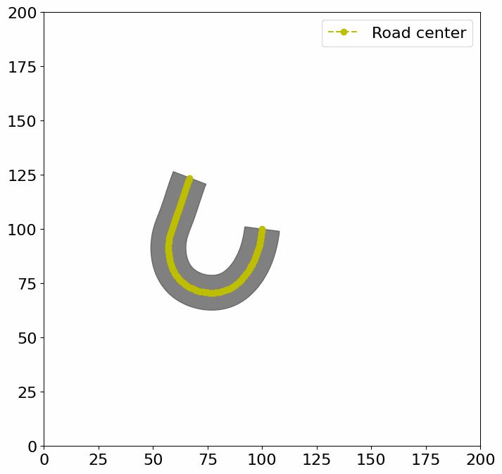

<p align="center">
	
</p>
<h1 align="center">
	Reinforcement learning Informed Genetic Algorithm for Autonomous system testing
</h1>

This repository contains the implementation of our tool RIGAA, adapted for the SBFT 2023 competition. This tool is based on our previous search based tool [AmbieGen](https://github.com/swat-lab-optimization/AmbieGen-tool):
```
@article{ambiegen,
  doi = {10.48550/ARXIV.2301.01234},
  url = {https://arxiv.org/abs/2301.01234},
  author = {Humeniuk, Dmytro and Khomh, Foutse and Antoniol, Giuliano},
  title = {AmbieGen: A Search-based Framework for Autonomous Systems Testing},
  publisher = {arXiv},
  year = {2023}}
```

with addition of a trained Reinforcement learning (RL) agent to generate some part of the initial population. The RL agent was trained on a simplified model of a vehicle, derived from first principles (vehicle kinematic model).

Originally, AmbieGen performs a two-objective search with NSGA-II algorithm (maximizing fault revealing power and diversity). RIGAA provides some high-quality individuals (with quality higher, than that of random search) in the initial population, allowing the algorithm to converge to better solutions faster, which is important, when an expensive fitness evaluation function is used. 

In the gif you can see an example of the road produced by a trained RL agent.

In this tool the NSGA-II algorithm implementation is is based on [pymoo framework](https://pymoo.org/).

## Usage
1. Here is an example of how to start test case generation with our tool for the "beamng" agent: 
    ```
    python competition.py --visualize-tests --time-budget 7200 --executor beamng --map-size 200 --module-name rigaa_generator --class-name RIGAATestGenerator --beamng-home "" --beamng-user "" 
    ``` 
## Authors
#### Dmytro Humeniuk, Foutse Khomh, Giuliano Antoniol
Polytechnique Montréal, Canada  
Contact e-mail: dmytro.humeniuk@polymtl.ca
